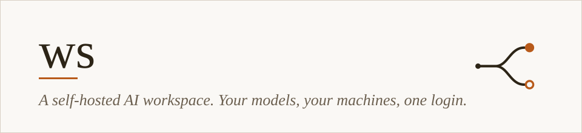
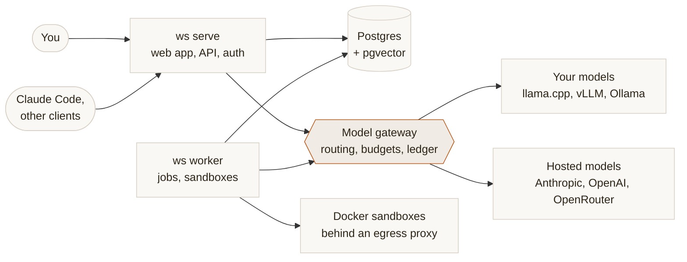

<p align="center">
  
</p>

<p align="center">
  <a href="LICENSE"></a>
  <a href="https://github.com/King-Technical-Consulting/ws-ai/releases"></a>
  <a href="https://ws-docs.pages.dev"></a>
</p>

**ws** is one Go binary, one Postgres and one login for working with AI on your own terms. Chat with documents the assistant builds, let it write code in a sandbox you can watch, and send every request to the model that fits: one on your own hardware, or a hosted one. ✨

> ws is under active development and has not had an independent security review. The [roadmap](docs/ROADMAP.md) says what is built and what is planned.

## What you get

- 💬 **Chat that builds things.** Pick a model or let a routing policy choose by what the request needs and what each endpoint costs. The assistant produces web pages, diagrams and code as versioned artifacts, rendered on a separate, locked-down origin.
- 🧑‍💻 **A coding mode you can watch.** Each code project gets its own Docker sandbox with an editor, a terminal and live previews. Running commands, pushing and opening pull requests ask for your approval by default.
- 🔀 **One gateway for every model.** llama.cpp, vLLM, Ollama and anything OpenAI-compatible sit next to Anthropic, OpenAI and OpenRouter. Budgets can block a call or send it to a local model, and every call is written to a usage ledger.
- 🤖 **Claude Code, routed through ws.** Point Claude Code at ws as its gateway, or let ws launch real Claude Code sessions on your own machines through a small CLI.
- 🗓️ **Agents, images and more.** Long-lived agents with cron and webhook triggers, image generation, ws as an MCP server for your other tools, and rented GPUs on demand (early).

## How it fits together



The two roles, `serve` and `worker`, coordinate through Postgres. Sandboxes reach the internet only through a worker-side proxy that holds the credentials, so secrets never enter a sandbox. Read more in [How ws works](docs/guides/how-it-works.md) and the [architecture](docs/ARCHITECTURE.md).

## Try it

You need Go 1.26, Node 22, Docker, and one model: a hosted provider key or an OpenAI-compatible server.

```bash
git clone https://github.com/King-Technical-Consulting/ws-ai && cd ws-ai
cp .env.example .env   # set WS_SESSION_SECRET, WS_OWNER_EMAIL and a provider key
make dev               # starts Postgres, then prints the next commands: make serve, make worker, make web-dev
```

`make serve` prints a first-account invite link; open it and you are in. The full walk-through is in [Start here](docs/START-HERE.md), and [Deploy with Compose](infra/compose/README.md) puts ws on a server.

> 📦 There are no published container images. Compose builds the app image from source when it cannot pull one.

## Learn more

- 📖 **[Documentation site](https://ws-docs.pages.dev)**: guides for chat, approvals, code projects, artifacts, Claude Code and Admin, plus the reference.
- 🗺️ **[Roadmap](docs/ROADMAP.md)**: what is built and what comes next.
- 🔐 **[Trust and security](docs/TRUST.md)**: how artifacts, sandboxes and secrets are isolated, and what ws does not protect against.
- ⚙️ **[Configuration](docs/CONFIGURATION.md)** and the **[HTTP API](docs/API.md)**.

## Feedback

Questions and ideas are welcome in Discussions, and bug reports in Issues. Please do not report security problems there: use private vulnerability reporting, described in [SECURITY.md](SECURITY.md). ws is released under PolyForm Strict, which does not allow changes or redistribution, so pull requests are not accepted.

## License

[PolyForm Strict License 1.0.0](LICENSE): noncommercial use only, and no changes or redistribution. Read the license for the exact terms; this summary is not legal advice.

Required Notice: Copyright Jeremy King (https://jeremyking.co)
